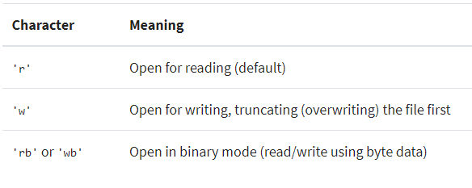
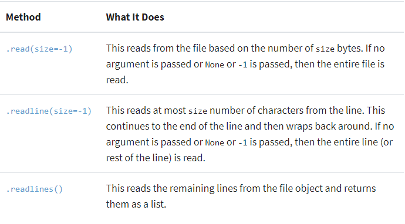
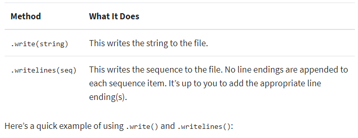

# FileIO & Exceptions
## What Is a File?

>> a `file` is a contiguous set of bytes used to store data. 

This data is `organized` in a specific format and can be anything as simple as a text file or as complicated as a program executable. In the end, these byte files translated into binary `1` and `0` for easier processing by the computer.

### **Files on most modern file systems are composed of three main parts:**
1. Header: metadata about the contents of the file (file name, size, type, and so on)
2. Data: contents of the file as written by the creator or editor
3. End of file (EOF): special character that indicates the end of the file


## File Paths
1. Folder Path: the file folder location on the file system where subsequent folders are separated by a backslash `\` (Windows)
2. File Name: the actual name of the file
3. Extension: the end of the file path pre-pended with a period `(.)` used to indicate the file type

> Hint:
> * The double-dot `(..)` can be chained together to traverse multiple directories above the current 
> * You can use double-dot (..) to move one directory up.


## Opening and Closing a File in Python

> open a file in Python
``` python
file = open('dog_breeds.txt')
```
>> its important to remember to close the file after opening it since its the best practice in python to avoid unwanted problems 


> close a file in Python (first way)
``` python 
reader = open('dog_breeds.txt')
try:
    # Further file processing goes here
finally:
    reader.close()
```

> close a file in Python (second way)
``` python
with open('dog_breeds.txt') as reader:
    # Further file processing goes here
```

>> The with statement automatically takes care of closing the file once it leaves the with block, even in cases of error. I highly recommend that you use the with statement as much as possible, as it allows for cleaner code and makes handling any unexpected errors easier for you.

## How you want to open the file
> The default and most common is 'r', which represents opening the file in read-only mode as a text file:

``` Python
with open('dog_breeds.txt', 'r') as reader:
    # Further file processing goes here
```



> ## There are three different categories of file objects:
>> 1. **Text files**
>>> ```python 
>>> open('abc.txt')
>>> open('abc.txt', 'r')
>>> open('abc.txt', 'w')
>>> ```
>> 2. **Buffered binary files** 
>>> A buffered binary file type is used for reading and writing binary files
>>> ``` python 
>>> >>> file = open('dog_breeds.txt', 'rb')
>>> type(file)
>>> <class '_io.BufferedReader'>
>>> file = open('dog_breeds.txt', 'wb')
>>> type(file)
>>> <class '_io.BufferedWriter'>
>> 3. **Raw binary files**
>>> generally used as a low-level building-block for binary and text streams.
>>> ``` python
>>> open('abc.txt', 'rb', buffering=0)
>>> >>> file = open('dog_breeds.txt', 'rb', buffering=0)
>>> type(file)
>>> <class '_io.FileIO'>
>>>```

## Reading and Writing Opened Files
There are multiple methods that can be called on a file object:


> **Here’s an example of how to open and read the entire file using `.read()`:**
>> ``` python
>> with open('dog_breeds.txt', 'r') as reader:
>>  # Read & print the entire file
>>    print(reader.read())
> **Here’s an example of how to read 5 bytes of a line each time using the Python `.readline()` method:**
>> ```python
>> with open('dog_breeds.txt', 'r') as reader:
>> print(reader.readline(5))
>> line and then "wraps" around
>> print(reader.readline(5))
>> print(reader.readline(5))
>> print(reader.readline(5))
>> print(reader.readline(5))
>> ```

## Iterating Over Each Line in the File
> Here’s an example of how to use the Python `.readline() `method to perform that iteration: (first way)
>> ``` Python
>> with open('dog_breeds.txt', 'r') as reader:
>>     line = reader.readline()
>>    while line != '': 
>>        print(line, end='')
>>        line = reader.readline()

> Another way you could iterate over each line in the file is to use the Python `.readlines()` method of the file object. 
> * Remember, `.readlines()` returns a list where each element in the list represents a line in the file:
>> ``` Python
>> with open('dog_breeds.txt', 'r') as reader:
>>    for line in reader.readlines():
>>       print(line, end='')
>> ```

### OR SIMPLY ITERATING ALL OVER THE FILE OBJECT 
>> ``` python
>> with open('dog_breeds.txt', 'r') as reader:
>>    for line in reader:
>>        print(line, end='')
>> ```

---
## Writing Opened Files Methods


> ## Here’s a quick example of using `.write()` and `.writelines()`:
>> ``` python
>> with open('dog_breeds.txt', 'r') as reader:
>>    # Note: readlines doesn't trim the line endings
>>    dog_breeds = reader.readlines()
>> with open('dog_breeds_reversed.txt', 'w') as writer:
>>    # Alternatively you could use
>>    # writer.writelines(reversed(dog_breeds))
>>
>>    # Write the dog breeds to the file in reversed order
>>    for breed in reversed(dog_breeds):
>>        writer.write(breed)

# Working With Bytes
Sometimes, you may need to work with files using byte strings. This is done by adding the `'b'` character to the mode argument. 
> ``` python
> with open('dog_breeds.txt', 'rb') as reader:
>     print(reader.readline())
> b'Pug\n'
----
# Tips and Tricks
## `__file__`
> The `__file__` attribute is a special attribute of modules, similar to `__name__`. It is:

     “the pathname of the file from which the module was loaded, if it was loaded from a file.” (Source

## Appending to a File
> Sometimes, you may want to append to a file or start writing at the end of an already populated file. This is easily done by using the `'a'` character for the mode argument
``` python
with open('dog_breeds.txt', 'a') as a_writer:
    a_writer.write('\nBeagle')

```

## Working With Two Files at the Same Time
> when you may want to read a file and write to another file at the same time.
``` python
d_path = 'dog_breeds.txt'
d_r_path = 'dog_breeds_reversed.txt'
with open(d_path, 'r') as reader, open(d_r_path, 'w') as writer:
    dog_breeds = reader.readlines()
    writer.writelines(reversed(dog_breeds))
``` 
## Creating Your Own Context Manager
> when you’ll need finer control of the file object by placing it inside a custom class. When you do this, using the with statement can no longer be used unless you add a few magic methods: `__enter__` and `__exit__`. By adding these, you’ll have created what’s called a **context manager**.

`__enter__()` is invoked when calling the with statement. `__exit__()`is called upon exiting from the with statement block.

``` python
class my_file_reader():
    def __init__(self, file_path):
        self.__path = file_path
        self.__file_object = None

    def __enter__(self):
        self.__file_object = open(self.__path)
        return self

    def __exit__(self, type, val, tb):
        self.__file_object.close()
```
you can use it similarly to the `open()` built-in:
 
``` python
with my_file_reader('dog_breeds.txt') as reader:
    # Perform custom class operations
    pass
```

[Check out Re-Invent the Snake! and other built-in libraries! ](https://realpython.com/read-write-files-python/)

---
 
# Python Exceptions: An Introduction
- A Python program terminates as soon as it encounters an error. 
- In Python, an error can be a syntax error or an exception. 

## Exceptions versus Syntax Errors

1. **`Syntax errors`** 
> occur when the parser detects an incorrect statement. 
2. **`exception error`**
> This type of error occurs whenever syntactically correct Python code results in an error.

* raise allows you to throw an exception at any time.
* assert enables you to verify if a certain condition is met and throw an exception if it isn’t.
* In the try clause, all statements are executed until an exception is encountered.
* except is used to catch and handle the exception(s) that are encountered in the try clause.
* else lets you code sections that should run only when no exceptions are encountered in the try clause.
* finally enables you to execute sections of code that should always run, with or without any previously encountered exceptions.


[Check out this link for more details ](https://realpython.com/python-exceptions/)