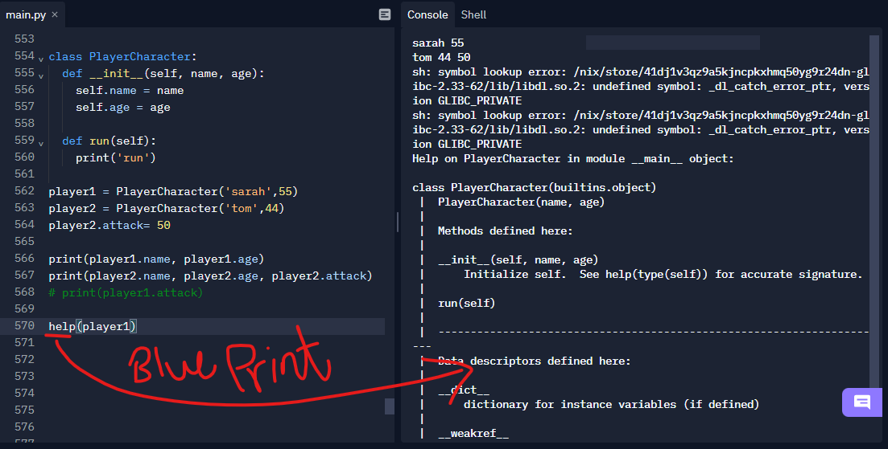

# Classes and Objects
> ## Everything in python is an Obj!

>> WHY? because everything type is a class!


 

So what we mean by class & obj?

 
### Classes are:
> is the blue print that contained of what we want to cerate like methods, functions, and anything else so essentially its a template.
### OBJs are:
> from the blue print i can create different objects using the class

instantiated a class means i just created a new instance(obj's)

 

---

## `init()`
The `__init__()` function, is a special function that is called when the class is being initiated. It's used for asigning values in a class.

## Accessing Object Variables
 

## Accessing Object Functions
> `Help()` blue print
 

> ## Exercise 1
``` python

class PlayerCharacter:
  membership= True
  #class obj attribute / static
  def __init__(self, name, age):
    #dynamic
    if (self.membership):
  # if (PlayerCharacter.membership):
      self.name = name
      self.age = age

  def shout(self):
    print(f'my name is {self.name}, and my age is {self.age}')

player1 = PlayerCharacter('sarah',55)
player2 = PlayerCharacter('tom',44)
player2.attack= 50

print(player1.name, player1.age)
print(player2.name, player2.age)
# help(player1)
print(player1.shout())
print(player2.shout())
```

> ## Exercise 2

``` python
#Given the below class:
class Cat:
  species = 'mammal'
  def __init__(self, name, age):
      self.name = name
      self.age = age

    # def get_oldest_cat(*args):
    #   return max(args)

# 1 Instantiate the Cat object with 3 cats

cat1 = Cat('tom1',12)
cat2 = Cat('tom2',10)
cat3 = Cat('tom3',50)


# 2 Create a function that finds the oldest cat

def get_oldest_cat(*args):
    return max(args)

# 3 Print out: "The oldest cat is x years old.". x will be the oldest cat age by using the function in #2

print(f"The oldest cat is {get_oldest_cat(cat1.age, cat2.age, cat3.age)} years old.")
```
# [CHECK THIS LINK OUT](https://www.makeuseof.com/tag/python-instance-static-class-methods/)

---

# Python Testing with pytest: Fixtures and Coverage
## Fixtures
functions will run before and after each test function to which its applied then cleaned up once done.

> `“Fixtures”`, They’re everything that test needs to do its thing.

At a basic level, test functions request fixtures by declaring them as arguments. 

In pytest, `“fixtures”` are functions you define that serve this purpose. But they don’t have to be limited to just the arrange steps. 

They can provide the act step, as well, and this can be a powerful technique for designing more complex tests, especially given how pytest’s fixture system works. But we’ll get into that further down.

We can tell pytest that a particular function is a fixture by decorating it with `@pytest.fixture`. 

``` python
import pytest


class Fruit:
    def __init__(self, name):
        self.name = name

    def __eq__(self, other):
        return self.name == other.name


@pytest.fixture
def my_fruit():
    return Fruit("apple")


@pytest.fixture
def fruit_basket(my_fruit):
    return [Fruit("banana"), my_fruit]


def test_my_fruit_in_basket(my_fruit, fruit_basket):
    assert my_fruit in fruit_basket
```

     Tests don’t have to be limited to a single fixture, either. They can depend on as many fixtures as you want, and fixtures can use other fixtures, as well.

----
# `Requesting” fixtures`
``` python
import pytest


class Fruit:
    def __init__(self, name):
        self.name = name
        self.cubed = False

    def cube(self):
        self.cubed = True


class FruitSalad:
    def __init__(self, *fruit_bowl):
        self.fruit = fruit_bowl
        self._cube_fruit()

    def _cube_fruit(self):
        for fruit in self.fruit:
            fruit.cube()


# Arrange
@pytest.fixture
def fruit_bowl():
    return [Fruit("apple"), Fruit("banana")]


def test_fruit_salad(fruit_bowl):
    # Act
    fruit_salad = FruitSalad(*fruit_bowl)

    # Assert
    assert all(fruit.cubed for fruit in fruit_salad.fruit)
```
# Fixtures can request other fixtures

``` python
# contents of test_append.py
import pytest


# Arrange
@pytest.fixture
def first_entry():
    return "a"


# Arrange
@pytest.fixture
def order(first_entry):
    return [first_entry]


def test_string(order):
    # Act
    order.append("b")

    # Assert
    assert order == ["a", "b"]
```

- Fixtures are reusable
- Fixtures can be requested more than once per test (return values are cached)

# Fixture scopes
> Fixtures are created when first requested by a test, and are destroyed based on their scope:

* `function`: the default scope, the fixture is destroyed at the end of the test.

- `class`: the fixture is destroyed during teardown of the last test in the class.

- `module`: the fixture is destroyed during teardown of the last test in the module.

- `package`: the fixture is destroyed during teardown of the last test in the package.

- `session`: the fixture is destroyed at the end of the test session.
--------

# [CHECK THIS LINK OUT](https://docs.pytest.org/en/6.2.x/fixture.html)

# Coverage

Coverage.py is a tool for measuring code coverage of Python programs. It monitors your program, noting which parts of the code have been executed, then analyzes the source to identify code that could have been executed but was not.

1. Install coverage.py: 

       $ pip install coverage
2. Use `coverage run` to run your test suite and gather data.

       $ coverage run -m pytest arg1 arg2 arg3

3. Use `coverage report` to report on the results

4. For a nicer presentation, use coverage html to get annotated HTML listings detailing missed lines: 
       
       $ coverage html

----------------------------------------------------------------

# Thinking Recursively in Python

> ## Keep this limitation in mind if you have a program that requires deep recursion.

# [CHECK THIS LINK OUT](https://realpython.com/python-thinking-recursively/)