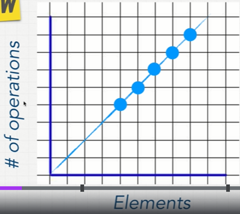

# Big O: Analysis of Algorithm Efficiency
**`Big O(oh)`** is an essential tool for computer scientists to analyze the complexity and cost of an algorithm, 
and an important practice for software engineers to understand algorithms more deeply.

## Good Code: 
- Readability 
- Scalable (Big O)

**Every computer will take a different time to run this code there are a lot of factors to consider like CPU, what I’m running on my pc, what other programming languages are using etc.**

### So how to know whose have better codes?
> Big-O notation talks about how much my code takes time to run
---

# Big-O Complexity Chart

## **When growing bigger & bigger with our input how much does the func or algorithm slow down**
[Big O: Analysis of Algorithm Efficiency](https://codefellows.github.io/common_curriculum/data_structures_and_algorithms/Code_401/class-05/resources/big_oh.html)
---
# Big-O Cheat Sheet

---
## O(n): the most common big=O notation
### As the number of the elements increases the # of operations will increase.

## O(n): Constant Time
### on big-o complexity chart, its performance consider as excellent 

[For more interesting details about:](https://www.quora.com/What-is-the-difference-between-big-oh-big-omega-and-big-theta-notations) What is the difference between big oh, big omega and big theta notations?

---

# Exercise01: Big-O Calculation

# Exercise02: Big-O Calculation

---
# In interviews, we don’t calculate things like that, we have 4 rules to know the big O notation like a ninja:
- 	Worst case
- 	Remove constant
- 	Different terms for inputs
- 	Drop non-dominate

## Review
* `Big O`: The worst case analysis of algorithm efficiency.
* `Running Time`: The amount of time required for an algorithm to complete.
* `Memory Space`: The amount of memory resources required for an algorithm to complete.
* `Input Size`: Represented by the variable n, the total size of values used as parameters in an algorithm.
* `Big Omega`: The best case analysis of algorithm efficiency.
* `Big Theta`: The typical or random case used for analysis of algorithm efficiency.

----

# Linked Lists
## What is a Linked List
A Linked List is a sequence of `Nodes` that are connected/linked to each other. The most defining feature of a Linked List is that each `Node` references the next `Node` in the link.

>> There are two types of Linked List - Singly and Doubly. We will be implementing a Singly Linked List in this implementation.

## `Terminology`
1. Linked List - A data structure that contains nodes that links/points to the next node in the list.
2. Singly - Singly refers to the number of references the node has. A Singly linked list means that there is only one reference, and the reference points to the Next node in a linked list.
3. Doubly - Doubly refers to there being two (double) references within the node. A Doubly linked list means that there is a reference to both the Next and Previous node.
4. Node - Nodes are the individual items/links that live in a linked list. Each node contains the data for each link.
5. Next - Each node contains a property called Next. This property contains the reference to the next node.
6. Head - The Head is a reference of type Node to the first node in a linked list.
7. Current - The Current is a reference of type Node to the node that is currently being looked at. When traversing, you create a new Current variable at the Head to guarantee you are starting from the beginning of the linked list.

[For more interesting details about:](https://codefellows.github.io/common_curriculum/data_structures_and_algorithms/Code_401/class-05/resources/singly_linked_list.html) 
- What is a Linked List
- Terminology:
- What does it look like
- Traversal
- Adding a Node
- Print Out Nodes
- Prerequisites

> A node only knows about what data it contains, and who its neighbor is.

## Different types of linked lists

> a linked list is usually efficient when it comes to adding and removing most elements, but can be very slow to search and find a single element.

[Resource Number 1](https://medium.com/basecs/whats-a-linked-list-anyway-part-2-131d96f71996) 

[Resource Number 2](https://medium.com/basecs/whats-a-linked-list-anyway-part-1-d8b7e6508b9d) 