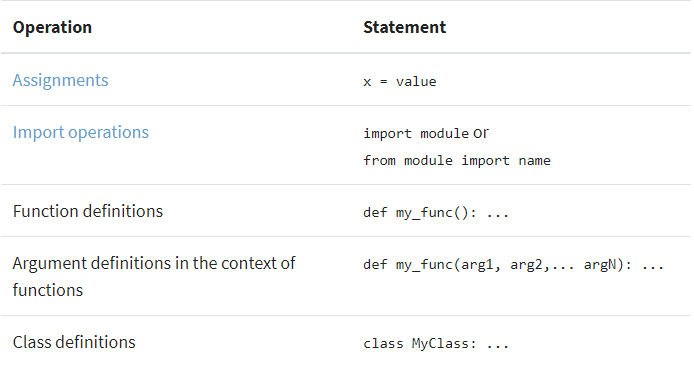
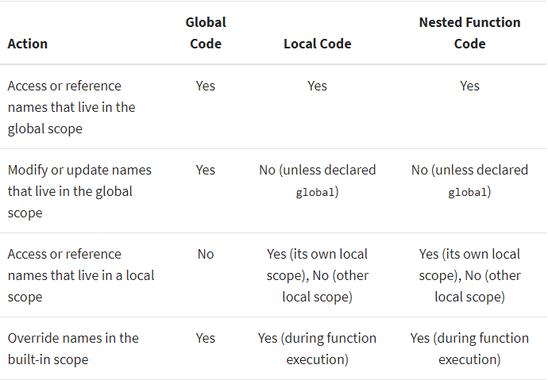
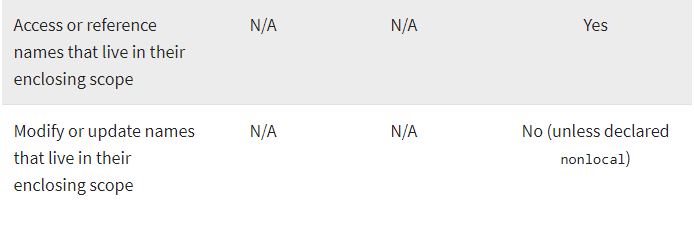

# Python Scope & the LEGB Rule: 
## Understanding Scope
In programming, the scope of a name defines the area of a program in which you can unambiguously access that name, such as variables, functions, objects, and so on. 

> Most commonly, you’ll distinguish two general scopes:

- `Global scope`: The names that you define in this scope are available to all your code.

- `Local scope`: The names that you define in this scope are only available or visible to the code within the scope.

## Names and Scopes in Python
Since Python is a `dynamically-typed` language, variables in Python come into existence when you first assign them a value. On the other hand, functions and classes are available after you define them using `def` or `class`, respectively. Finally, `modules` exist after you import them. As a summary, you can create Python names through one of the following operations:



## Python Scope vs Namespace

>> Python scopes are implemented as `dictionaries` that map names to objects. These dictionaries are commonly called `namespaces`. These are the concrete mechanisms that Python uses to store names. They’re stored in a special attribute called .`__dict__`.


``` python
>>> import sys
>>> sys.__dict__.keys()
dict_keys(['__name__', '__doc__', '__package__',..., 'argv', 'ps1', 'ps2'])
```

## Using the LEGB Rule for Python Scope
Python resolves names using the `so-called` LEGB rule, which is named after the Python scope for names. 

> The letters in LEGB stand for `Local`, `Enclosing`, `Global`, and `Built-in`. 

- `Local` (or function) scope is the code block or body of any Python function or lambda expression. 

- `Enclosing` (or nonlocal) scope is a special scope that only exists for nested functions. If the local scope is an inner or nested function, then the enclosing scope is the scope of the outer or enclosing function. 

- `Global` (or module) scope is the top-most scope in a Python program, script, or module. 

- `Built-in` scope is a special Python scope that’s created or loaded whenever you run a script or open an interactive session. 

## Functions: The Local Scope
The `local scope` or function scope is a Python scope created at function calls. 

> Every time you call a function, you’re also creating a new local scope. On the other hand, you can think of each def statement and lambda expression as a blueprint for new local scopes. These local scopes will come into existence whenever you call the function at hand.

``` python
>>> def square(base):
...     result = base ** 2
...     print(f'The square of {base} is: {result}')
...
>>> square(10)
The square of 10 is: 100
>>> result  # Isn't accessible from outside square()
Traceback (most recent call last):
  File "<stdin>", line 1, in <module>
    result
NameError: name 'result' is not defined
>>> base  # Isn't accessible from outside square()
Traceback (most recent call last):
  File "<stdin>", line 1, in <module>
    base
NameError: name 'base' is not defined
>>> square(20)
The square of 20 is: 400
```
# Nested Functions: The Enclosing Scope
`Enclosing` or `nonlocal` scope is observed when `you nest functions inside other functions`. The enclosing scope was added in Python 2.2. It takes the form of the local scope of any enclosing function’s local scopes. Names that you define in the enclosing Python scope are commonly known as `nonlocal names`. 

``` python
>>> def outer_func():
...     # This block is the Local scope of outer_func()
...     var = 100  # A nonlocal var
...     # It's also the enclosing scope of inner_func()
...     def inner_func():
...         # This block is the Local scope of inner_func()
...         print(f"Printing var from inner_func(): {var}")
...
...     inner_func()
...     print(f"Printing var from outer_func(): {var}")
...
>>> outer_func()
Printing var from inner_func(): 100
Printing var from outer_func(): 100
>>> inner_func()
Traceback (most recent call last):
  File "<stdin>", line 1, in <module>
NameError: name 'inner_func' is not defined
```
 
>> `Note`: In a sense, `inner_func()` is a temporary function that comes to life only during the execution of its enclosing function, `outer_func()`. Note that `inner_func()` is only visible to the code in `outer_func()`.

## Modules: The Global Scope

From the moment you start a Python program, you’re in the global Python scope. Internally, Python turns your program’s main script into a module called `__main__` to hold the main program’s execution. The namespace of this module is the main global scope of your program.

``` python
>>> __name__
'__main__'
```

``` python
>>> dir()
['__annotations__', '__builtins__',..., '__package__', '__spec__']
>>> var = 100  # Assign var at the top level of __main__
>>> dir()
['__annotations__', '__builtins__',..., '__package__', '__spec__', 'var']
```
>> `Note`: There’s only one global Python scope per program execution. This scope remains in existence until the program terminates and all its names are forgotten. Otherwise, the next time you were to run the program, the names would remember their values from the previous run.

### Whenever you assign a value to a name in Python, one of two things can happen:

- You create a new name
- You update an existing name

``` python
>>> var = 100  # A global variable
>>> def func():
...     print(var)  # Reference the global variable, var
...     var = 200   # Define a new local variable using the same name, var
...
>>> func()
Traceback (most recent call last):
  File "<stdin>", line 1, in <module>
    func()
  File "<stdin>", line 2, in func
    print(var)
UnboundLocalError: local variable 'var' referenced before assignment
```
## The Built-In Scope

The `built-in scope` is a special Python scope that’s implemented as a standard library module named `builtins` in Python 3.x. All of Python’s built-in objects live in this module. They’re automatically loaded to the built-in scope when you run the Python interpreter. Python searches `builtins` last in its LEGB lookup, so you get all the names it defines for free. This means that you can use them without importing any module.

``` python
>>> import builtins  # Import builtins as a regular module
>>> dir(builtins)
['ArithmeticError', 'AssertionError',..., 'tuple', 'type', 'vars', 'zip']
>>> builtins.sum([1, 2, 3, 4, 5])
15
>>> builtins.max([1, 5, 8, 7, 3])
8
>>> builtins.sorted([1, 5, 8, 7, 3])
[1, 3, 5, 7, 8]
>>> builtins.pow(10, 2)
100
```



## Modifying the Behavior of a Python Scope
Python provides two keywords that allow you to modify the content of `global` and `nonlocal` names. These two keywords are:

- The global Statement
- The nonlocal Statement

## Using Enclosing Scopes as Closures
`Closures` are a special use case of the enclosing Python scope. When you handle a nested function as data, the statements that make up that function are packaged together with the environment in which they execute. The resulting object is known as a closure. In other words, a closure is an inner or nested function that carries information about its enclosing scope, even though this scope has completed its execution.

>> `Note`: You can also call this kind of function a factory, a factory function, or—to be more precise—a closure factory to specify that the function builds and returns closures (an inner function), rather than classes or instances.

``` python
>>> def power_factory(exp):
...     def power(base):
...         return base ** exp
...     return power
...
>>> square = power_factory(2)
>>> square(10)
100
>>> cube = power_factory(3)
>>> cube(10)
1000
>>> cube(5)
125
>>> square(15)
225
```
## Bringing Names to Scope With import
When you write a Python program, you typically organize the code into several modules. For your program to work, you’ll need to bring the names in those separate modules to your `__main__` module. To do that, you need to import the modules or the names explicitly. This is the only way you can use those names in your main global Python scope.


## [Using Scope Related Built-In Functions](https://realpython.com/python-scope-legb-rule/)

There are many built-in functions that are closely related to the concept of Python scope and namespaces. In previous sections, you’ve used dir() to get information on the names that exist in a given scope. Besides dir(), there are some other built-in functions that can help you out when you’re trying to get information about a Python scope or namespace. In this section, you’ll cover how to work with:

- globals()
- locals()
- dir()
- vars()

