# Introduction to SQL

## Relational databases
Represents a collection of related `two-dimensional` tables. Each of the tables are similar to an Excel spreadsheet, with a fixed number of named columns `the attributes or properties of the table` and any number of rows of data. 

### Table: Vehicles- Example:

| Id  | Make/Model  |  # Wheels | # Doors  | Type  |
|:-:|:-:|:-:|:-:|:-:|
| 1 | Ford Focus  | 4  | 4  | Sedan  |
| 2 | Tesla Roadster | 4  | 2  | Sport  |
| 3 | Kawakasi Ninja  | 2  | 0  | Motorcycle  |

### In the common lesson we will learn how to answer these questions:
- What types of vehicles are on the road have less than four wheels?
- How many models of cars does Tesla produce?

----

# SQL Lesson 1: SELECT queries 101

> A **query** in itself is just a statement which declares what data we are looking for, where to find it in the database, and optionally, how to transform it before it is returned

### Exercise 01 
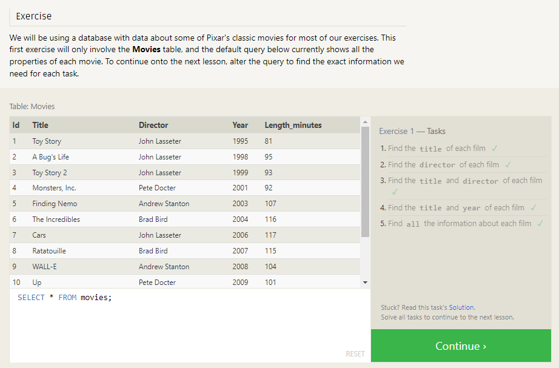

---
# SQL Lesson 2: Queries with constraints (Pt. 1)

> In order to filter certain results from being returned, we need to use a `WHERE` clause in the query. 

The clause is applied to each row of data by checking specific column values to determine whether it should be included in the results or not.

> More complex clauses can be constructed by joining numerous **AND** or **OR** logical keywords (ie. num_wheels >= 4 AND doors <= 2). 

### Exercise 02 
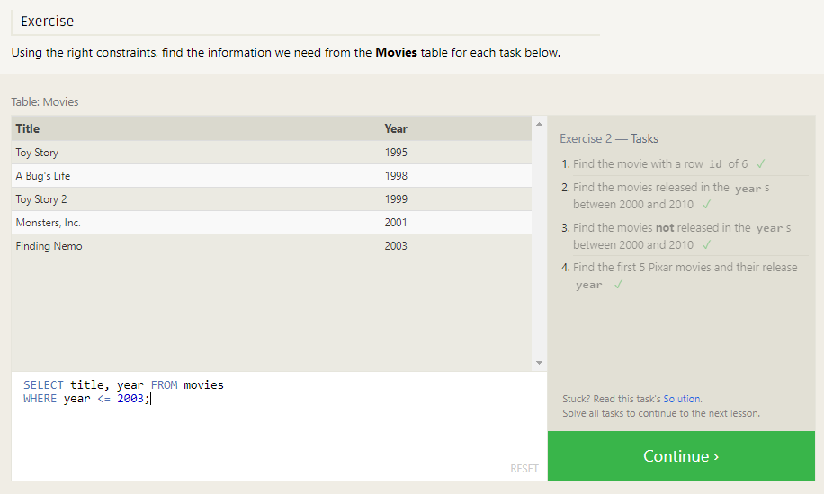

---

# SQL Lesson 3: Queries with constraints (Pt. 2)

### Few common text-data specific operators below:
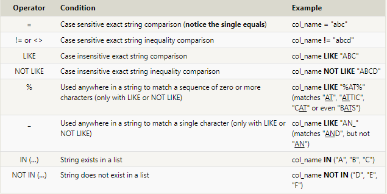

### Exercise 03
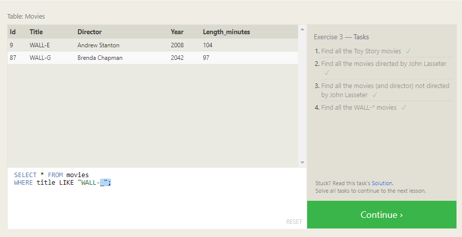

---
# SQL Lesson 4: Filtering and sorting Query results

> SQL provides a convenient way to discard rows that have a duplicate column value by using the **DISTINCT** keyword.

- List all directors of Pixar movies (alphabetically), without duplicates 

SELECT DISTINCT director FROM movies
ORDER BY director ASC;

- List the last four Pixar movies released (ordered from most recent to least)

SELECT title, year FROM movies
ORDER BY year DESC
LIMIT 4;

- List the first five Pixar movies sorted alphabetically

SELECT title FROM movies
ORDER BY title ASC
LIMIT 5;

- List the next five Pixar movies sorted alphabetically

SELECT title FROM movies
ORDER BY title ASC
LIMIT 5 OFFSET 5;

### Exercise 04
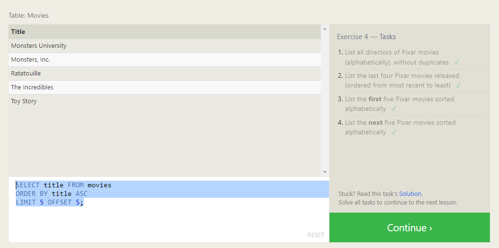

---
# SQL Review: Simple SELECT Queries

### Exercise 05
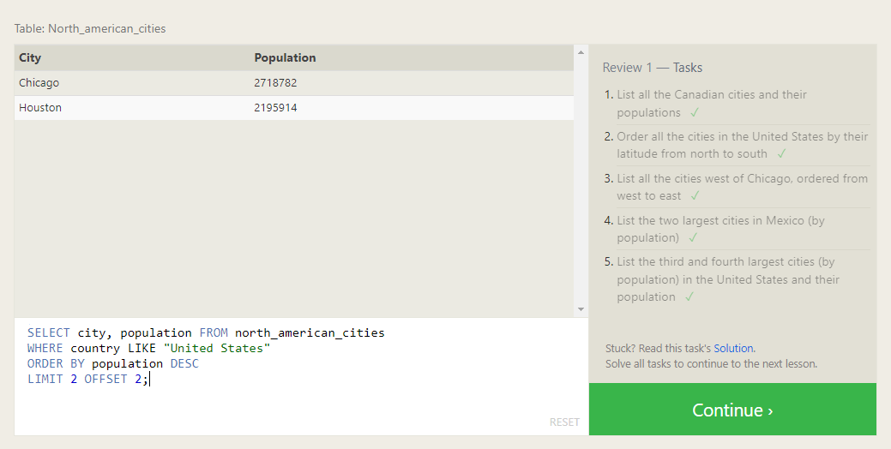

---
# SQL Lesson 6: Multi-table queries with JOINs

## Database normalization
> Database `normalization` is useful because it **minimizes duplicate** data in any single table, and allows for data in the database to grow independently of each other 

## Multi-table queries with JOINs

Tables that share information about a single entity need to have a `primary key` that identifies that entity `uniquely` across the database. One common primary key type is an **auto-incrementing integer** (because they are space efficient), but it can also be a string, hashed value, so long as it is `unique`.

> Using the `JOIN` clause in a query, we can combine row data across two separate tables using this unique key. The first of the joins that we will introduce is the `INNER JOIN`.

The **INNER JOIN** is a process that matches rows from the first table and the second table which have the same key (as defined by the ON constraint) to create a result row with the combined columns from both tables. After the tables are joined, the other clauses we learned previously are then applied.

### Did you know?
##### You might see queries where the `INNER JOIN` is written simply as a `JOIN`. These two are equivalent, but we will continue to refer to these joins as inner-joins because they make the query easier to read once you start using other types of joins, which will be introduced in the following lesson.

### Exercise 06
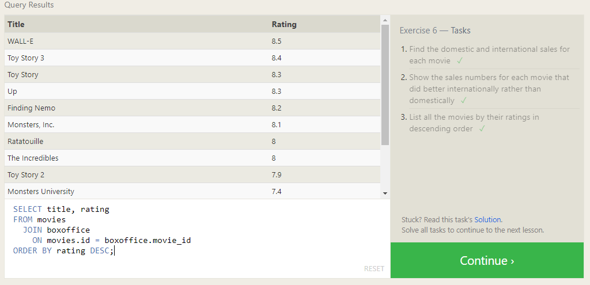

---
# SQL Lesson 13: Inserting rows

When inserting data into a database, we need to use an `INSERT` statement, which declares which table to write into, the columns of data that we are filling, and one or more rows of data to insert. In general, each row of data you insert should contain values for every corresponding column in the table. You can insert multiple rows at a time by just listing them sequentially.

> In some cases, if you have incomplete data and the table contains columns that support default values, you can insert rows with only the columns of data you have by specifying them explicitly.

### Exercise 07
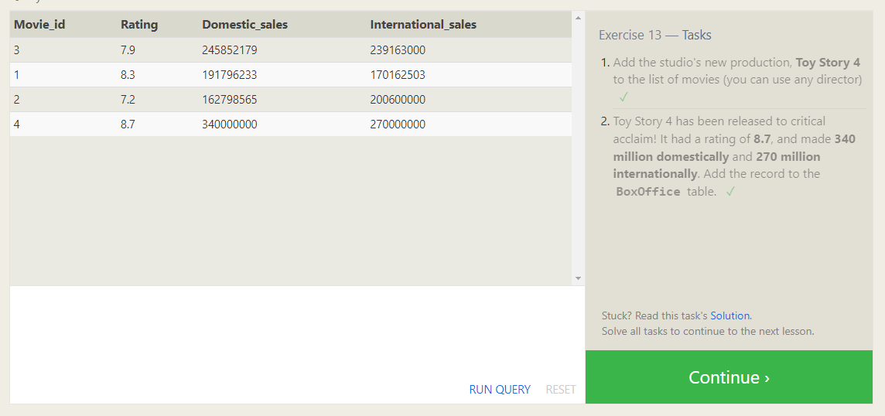

---
# SQL Lesson 14: Updating rows
A common task is to `update` existing data, which can be done using an `UPDATE` statement. Similar to the **INSERT** statement, you have to specify exactly which table, columns, and rows to `update`. In addition, the data you are updating has to match the data type of the columns in the table schema.

### Exercise 08
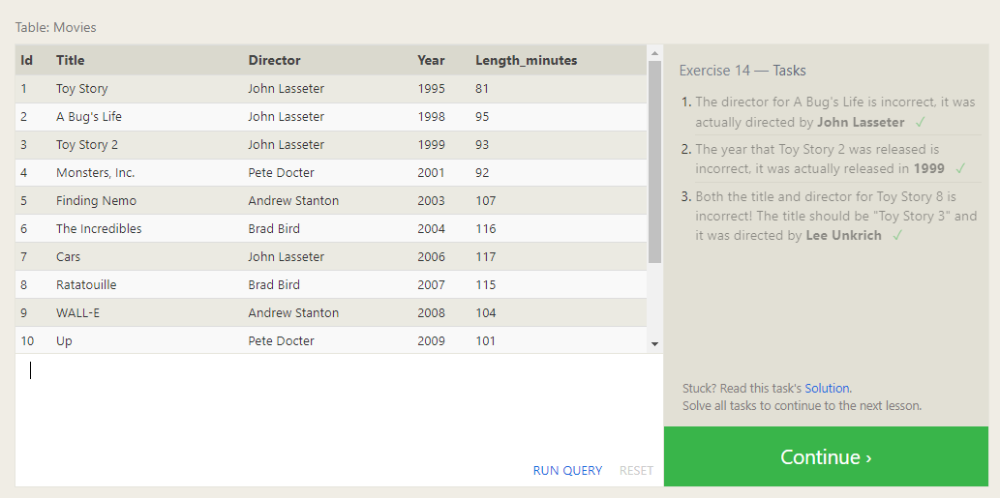

---
# SQL Lesson 15: Deleting rows

> When you need to delete data from a table in the database, you can use a DELETE statement, which describes the table to act on, and the rows of the table to delete through the WHERE clause.

### Exercise 09
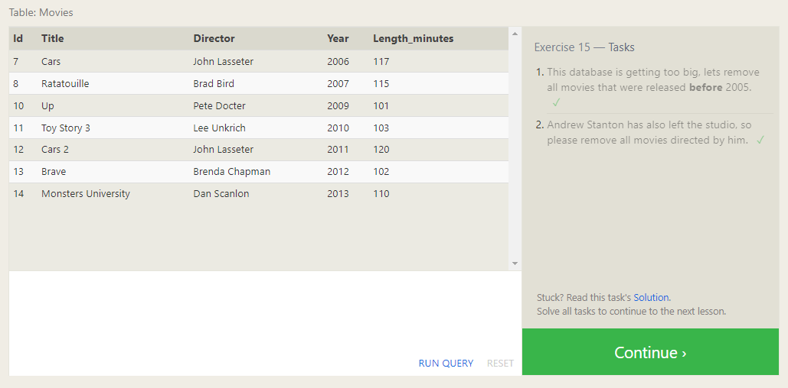

---
# SQL Lesson 16: Creating tables
### Table data types
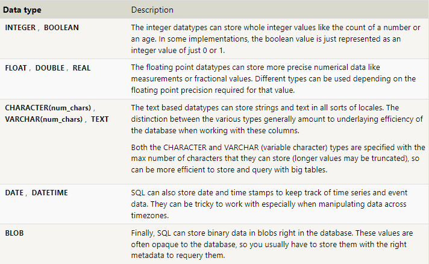

### Table constraints
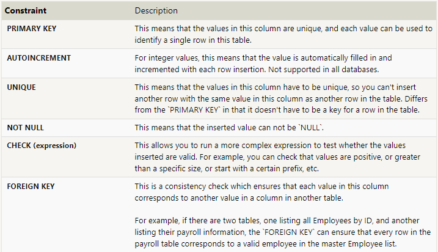

### Exercise 10
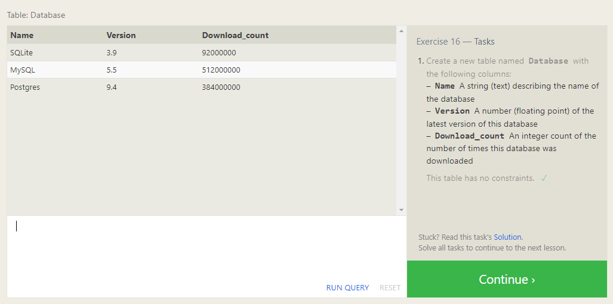

---
# SQL Lesson 17: Altering tables

### Adding columns
 > The syntax for adding a new column is similar to the syntax when creating new rows in the `CREATE TABLE` statement. You need to specify the data type of the column along with any potential table constraints and default values to be applied to both existing and new rows. In some databases like MySQL, you can even specify where to insert the new column using the `FIRST` or `AFTER` clauses, though this is not a standard feature.

 ### Removing columns
> Dropping columns is as easy as specifying the column to drop, however, some databases (including SQLite) don't support this feature. Instead you may have to create a new table and migrate the data over.

### Renaming the table
> If you need to rename the table itself, you can also do that using the `RENAME` TO clause of the statement.

### Exercise 11
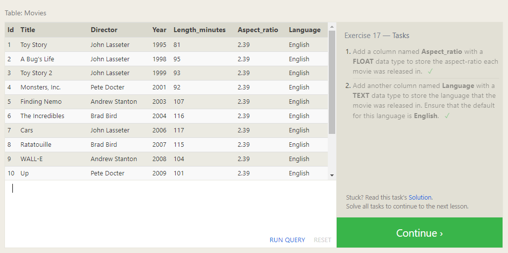

---
# SQL Lesson 18: Dropping tables
Like the `CREATE TABLE`statement, the database may throw an error if the specified table does not exist, and to suppress that error, you can use the `IF EXISTS` clause.

In addition, if you have another table that is dependent on columns in table you are removing (for example, with a `FOREIGN KEY` dependency) then you will have to either update all dependent tables first to remove the dependent rows or to remove those tables entirely.

### Exercise 12
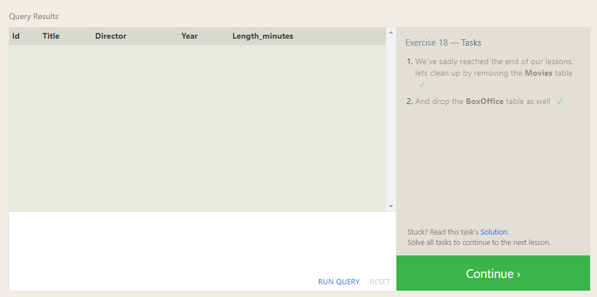