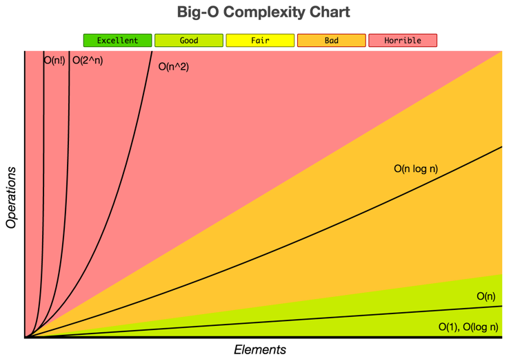
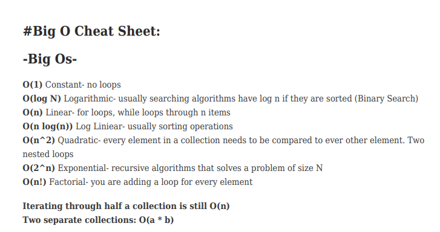
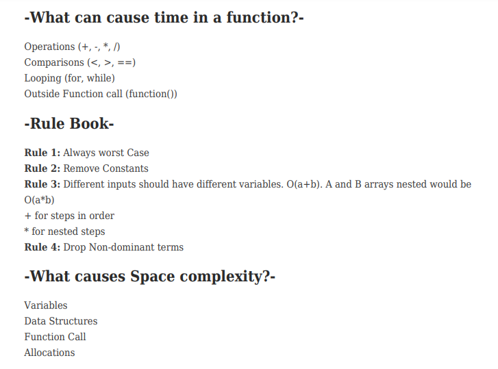
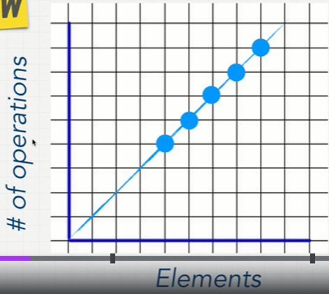
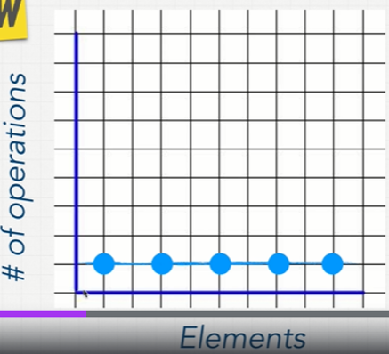

# Read: Class 01 - Code 401
## Suffering is pain without purpose. Pain with no higher goal. Pain with no dreams, no ambition, no aspiration.

### After 10 weeks i'll be able to answer these questions 

- What’s your perspective?
- Why are you doing this?
- Do you want what comes at the end of this journey?
- Are you doing this for you?

# REMINDER for the future me --> Don’t experience the pain in silence! 

It’s not easy, nor is it common. This is why such skilled people are highly-valued in the industry. 
You are building your value. You are experiencing the pain of growth. **Live it, love it** , 
and take it forward into your future as a full-stack software developer capable of meeting all challenges with a clear head and strong heart.

----

# A beginner's guide to Big-O Notation:

> The Big-O notation is an essential tool for computer scientists to analyze the complexity and cost of an algorithm, 
and an important practice for software engineers to understand algorithms more deeply.

## Good Code: 
- Readability 
- Scalable (Big O)

**Every computer will take a different time to run this code there are a lot of factors to consider like CPU, what I’m running on my pc, what other programming languages are using etc.**

### So how to know whose have better codes?
> Big-O notation  talks about how much my code takes time to run
---

# Big-O Complexity Chart

## **When growing bigger & bigger with our input how much does the func or algorithm slow down**
<!-- [manual pages](file:///C:/Users/sarah/AppData/Local/Temp/MicrosoftEdgeDownloads/9a58f527-481b-4002-a738-dab316ba767e/BigO-cheat-sheet+(1).pdf) -->
---
# Big-O Cheat Sheet

---
## O(n): the most common big=O notation
### As the number of the elements increases the # of operations will increase.

## O(n): Constant Time
### on big-o complexity chart, its performance consider as excellent 

[For more interesting details:](https://www.quora.com/What-is-the-difference-between-big-oh-big-omega-and-big-theta-notations)

