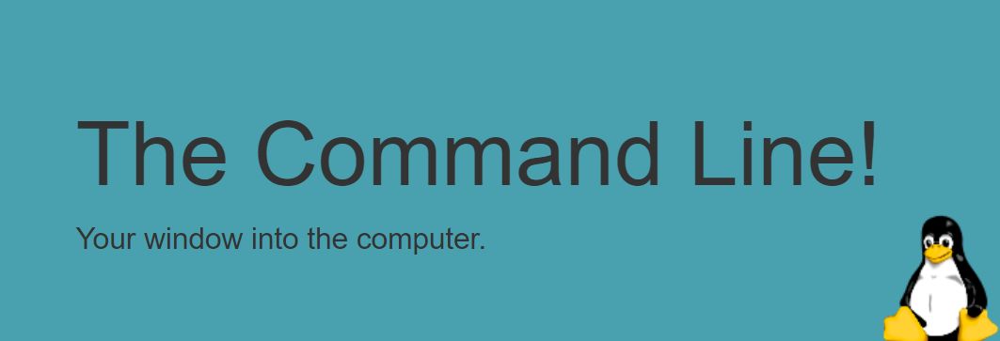

# Linux Tutorial
## Linux Tutorial - 1. The Command Line

> The command line is an interesting beast

| Id  | Linux  | Using For  |
|:-:|:-:|:-:|
| 1  | echo  | to know which shell you are using  |

----
## Shortcuts 
1. You can [traverse](https://ryanstutorials.net/linuxtutorial/commandline.php) this history using the up and down arrow keys.
2. You can also edit these commands using the left and right arrow keys to move the cursor where you want.

---
# Linux Tutorial - 2. Navigation

| Id  | Linux  | Using For  |
|:-:|:-:|:-:|
| 1  | pwd   | Print Working Directory Make use of this command often so as to remind yourself where you presently are.  |
| 2  |  ls  | What's in Our Current Location?  |
| 3  |  ls [options] [location]  | In the above example, the square brackets ( [ ] ) mean that those items are optional, we may run the command with or without them.  |
| 4  | ls -l   | which indicates we are going to do a long listing. A long listing First character indicates whether it is a normal file ( - ) or directory ( d ) |
| 5  |  ls /etc  | it tells ls not to list our current directory but instead to list that directories contents  |
| 6  |  ls -l /etc  | it did a long listing of the directory /etc  |
| 7  |  ...  | I have cut out some of the command's normal output for brevity's sake  |

## Paths

`Relative path`
> A file or directory location relative to where we currently are in the file system.

`Absolute path`
> A file or directory location in relation to the root of the file system.

| Id  | Linux  | Using For  |
|:-:|:-:|:-:|
| 1  | ~ (tilde)  | This is a shortcut for your home directory. |
| 2  | . (dot)  | This is a reference to your current directory. |
| 3  | .. (dotdot)  | This is a reference to the parent directory. |
| 4  |  cd [location] | In order to move around in the system |

## Shortcuts
1. If you run the command [cd](https://ryanstutorials.net/linuxtutorial/navigation.php) without any arguments then it will always take you back to your home directory.

2. When you start typing a path you may hit the Tab key on your keyboard at any time which will invoke an auto `complete action`.

----
# Linux Tutorial - 3. More About Files
> ## **Everything is a File! Even directories!**

| Id  | Linux  | Using For  |
|:-:|:-:|:-:|
| 1  | file [path]  | obtain information about what type of file a file or directory is. |
| 2  | ls -a  | List the contents of a directory, including hidden files.  |

>        path is a means to get to a particular location in the system and that location is a file.

> ## **Linux is Case Sensitive**

`two command line arguments`. cd moves into whichever directory is specified by the first command line argument only. To get around this we need to identify to the terminal that we wish Holiday Photos to be seen as a `single command line argument`. There are two ways to go about this:

1. Anything inside quotes is considered a single item.
----> cd 'Holiday Photos'

2. Another method is to use what is called an escape character, which is a backslash ( \ ). What the backslash does is escape (or nullify) the special meaning of the next character.

## Shortcut
> If you use [Tab Completion](https://ryanstutorials.net/linuxtutorial/aboutfiles.php) before encountering the space in the directory name then the terminal will `automatically escape` any spaces in the name for you.

> ### **Hidden Files and Directories**

    Linux actually has a very simple and elegant mechanism for specifying that a file or directory is hidden. If the file or directory's name begins with a . `(full stop)` then it is considered to be hidden. You don't even need a special command or action to make a file hidden. Files and directories may be hidden for a variety of reasons. 

    Configuration files for a particular user (which are normally stored in their home directory) are hidden for instance so that they don't get in the way of the user doing their everyday tasks.

----

# Linux Tutorial - 4. Manual Pages
## Manual Pages
The [manual pages](https://ryanstutorials.net/linuxtutorial/manual.php) are a set of pages that explain every command available on your system including what they do.

| Id  | Linux  | Using For  |
|:-:|:-:|:-:|
| 1  | man ls | Look up the manual page for a particular command. |
| 2  | man -k | Do a keyword search for all manual pages containing the given search term.  |
| 3  | /<term>  | Within a manual page, perform a search for `term` |
| 4  | n  | After performing a search within a manual page, select the next found item.|

----

# Linux Tutorial - 5. File Manipulation

| Id  | Linux  | Using For  |
|:-:|:-:|:-:|
| 1  | mkdir [options] <Directory> | Make Directory - ie. Create a directory.  |
| 2  | rmdir | Remove Directory - ie. Delete a directory.  |
| 3  | touch | Create a blank file.  |
| 4  | cp | Copy - ie. Copy a file or directory.  |
| 5  | mv | Move - ie. Move a file or directory (can also be used to rename).  |
| 6  | rm | Remove - ie. Delete a file.  |
| 7  | mkdir -p | which tells mkdir to make parent directories as needed  |
| 8  | mkdir -pv | which makes mkdir tell us what it is doing  |
| 9  | cp -r | which stands for recursive, we may copy directories. Recursive means that we want to look at a directory and all files and directories within it, and for subdirectories, go into them and do the same thing and keep doing this.  |

### Removing a Directory
> Two things to note. 
- Firstly, rmdir supports the -v and -p options similar to mkdir. 
- Secondly, a directory must be empty before it may be removed.

-----

# Linux Tutorial - Cheat Sheet

This cheat sheet is intended to be a quick reminder for the main concepts involved in using the command line and assumes you already understand their usage. If you are new to the Linux command line we strongly suggest you work through the Linux tutorial from the beginning. 

# LINK TO THE [CHEAT SHEET](https://ryanstutorials.net/linuxtutorial/cheatsheet.php) PAGE