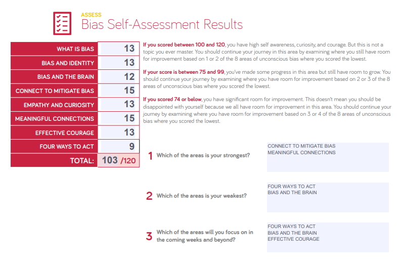

# Prepare My Mindset 

### Upgrade your technical skills with deliberate practice
 

> The mistake most weak pianists make is playing, not practicing. If you walk into a music hall at a local university, you’ll hear people ‘playing’ by running through their pieces. This is a huge mistake. Strong pianists drill the most difficult parts of their music, rarely, if ever playing through their pieces in entirety.

[Quoted from the greatest Cal Newport:](https://web.archive.org/web/20160616225417/http://www.happybearsoftware.com/upgrade-your-technical-skills-with-deliberate-practice)

The most important thing to change your life is to move because freezing in the same place and dreaming about a fortune is not an equal process.

    It doesn't matter a great deal what the end result is, only what you learned on the way.

----

# The power of believing that you can improve

the idea that we can grow our brain's capacity to learn and to solve problems. In this talk, she describes two ways to think about a problem that’s slightly too hard for you to solve. Are you not smart enough to solve it … or have you just not solved it [yet? ](https://www.ted.com/talks/carol_dweck_the_power_of_believing_that_you_can_improve?language=en)

 ---

# Assessing Bias
### My Result

from now on ill start focusing on the `FOUR WAYS TO ACT` & `BIAS AND THE BRAIN` as they say in the result i have high self awareness, curiosity, and courage. 

> But this is not a topic i ever master. i should continue my journey in this area by examining where i still have room for improvement based on 1 or 2 of the 8 areas of unconscious bias where i scored the lowest

---

# Measuring Emotional Intelligence

> Emotional Intelligence is learnable and developmental.

           since I score below 18 in this section I need to focus and learn more about it I always thought that emotional intelligence is something that you cant learn because you got it from your environment and the way you grew up but apparently I'm wrong about it and I still have the chance to learn & develop myself.

----

# The power of passion and perseverance

IQ wasn't the only thing separating the successful students from those who struggled. Here, she explains her theory of ["grit"](ted.com/talks/angela_lee_duckworth_grit_the_power_of_passion_and_perseverance) as a predictor of success.

The first step to achieve something is to believe that you can achieve it! There can be several who will say that you are not going to make it. But believing in yourself will make it possible. The quote by Audrey very clearly gives this message.

----

# A kinder, gentler philosophy of success

> snobbery is when someone takes a small part of you and uses that to come to a complete vision of you
 
 the next time you see somebody driving a ferrari don't think, this is somebody who is greedy, think this is someone who is incredibly vulnerable and in need for love.

[ Meritocratic:](https://www.ted.com/talks/alain_de_botton_a_kinder_gentler_philosophy_of_success) (we adopt a meritocratic approach meaning we reward top performers)
